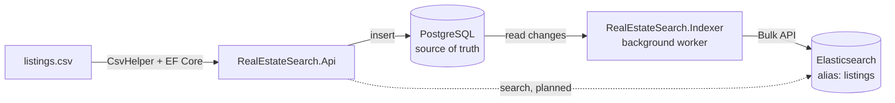

# RealEstateSearch

A map-based listing search built on **PostgreSQL as the source of truth** and **Elasticsearch as a search-optimized copy**, kept in sync by a background worker.

Users pick a location (neighbourhood or map area) and narrow results with a few filter buttons: price, room type, guests, and minimum stay.

> Status: the worker creates the index and copies all searchable listings on startup. Incremental sync and the search API are in progress (see [Roadmap](#roadmap)).

## Architecture



- **PostgreSQL** stores every listing, including ones that should not be searchable.
- **Elasticsearch** holds only listings that can be shown to users, structured for filtering and geo queries.
- **The Indexer** is a separate process so the API can scale out while exactly one sync worker runs.

## Tech Stack

| Area | Choice |
|---|---|
| Runtime | .NET 10 (ASP.NET Core, Worker Service) |
| Database | PostgreSQL 16, EF Core 10 + Npgsql provider |
| Search | Elasticsearch 9.5.3, `Elastic.Clients.Elasticsearch` 9.5.3 |
| Tooling | Kibana 9.5.3 (Dev Tools), Docker Compose |
| CSV parsing | CsvHelper |

## Project Structure

```
.
├── docker-compose.yml                  # PostgreSQL, Elasticsearch, Kibana
├── RealEstateSearch.slnx
└── src/
    ├── RealEstateSearch.Data/          # Shared data access
    │   ├── AppDbContext.cs             #   sets CreatedAt/UpdatedAt on save
    │   ├── Models/Listing.cs
    │   └── Migrations/
    ├── RealEstateSearch.Api/           # Web API
    │   └── SeedData/                   #   CSV importer + listings.csv
    └── RealEstateSearch.Indexer/       # Sync worker
        ├── Worker.cs                   #   orchestrates the steps
        ├── Elasticsearch/
        │   ├── listings-index.json     #   index settings + mappings
        │   ├── ListingIndexManager.cs  #   creates index and alias
        │   └── ListingDocument.cs      #   document shape + "is searchable" rule
        └── Sync/
            └── ListingSyncer.cs        #   reads PostgreSQL, sends Bulk requests
```

## Getting Started

**Prerequisites:** .NET 10 SDK, Docker Desktop, and the EF Core CLI (`dotnet tool install --global dotnet-ef`).

```bash
# 1. Start PostgreSQL, Elasticsearch, and Kibana
docker compose up -d

# 2. Create the database schema
dotnet ef database update \
  --project src/RealEstateSearch.Data \
  --startup-project src/RealEstateSearch.Api

# 3. Import listings from CSV (runs once, skipped when data already exists)
dotnet run --project src/RealEstateSearch.Api

# 4. Create the Elasticsearch index and copy searchable listings into it
dotnet run --project src/RealEstateSearch.Indexer
```

The worker logs `Backfill finished: 2660 indexed, ...` when the copy is done; stop it with `Ctrl+C`.

| Service | URL |
|---|---|
| Elasticsearch | http://localhost:9200 |
| Kibana Dev Tools | http://localhost:5601/app/dev_tools#/console |
| PostgreSQL | `localhost:5432` (db `realestate`, user/password `postgres`) |

All ports are bound to `127.0.0.1` only, because Elasticsearch security is disabled for local development.

## Data Import

Source: [Inside Airbnb](https://insideairbnb.com/) San Diego listings (CC BY 4.0). The file has 24,837 lines but 13,225 records, because descriptions contain quoted line breaks; CsvHelper handles this correctly where a naive `Split(',')` would not. The importer currently loads the first 3,000 records.

| Rule | Reason |
|---|---|
| Rows without an ID or coordinates are skipped and counted | Defaulting to `0` would create fake data, e.g. a listing at `(0, 0)` |
| Missing optional fields are stored as `null` | A missing value is different from `0` |
| Prices are `decimal` (`numeric` in PostgreSQL) | Money must not have floating point error |
| Dates are parsed with a fixed format and stored as UTC | PostgreSQL `timestamptz` only accepts UTC through Npgsql |
| The Airbnb ID is the primary key (`ValueGeneratedNever`) | The same ID is reused as the Elasticsearch `_id` |
| IDs are parsed strictly (`NumberStyles.None`) | Excel shows 19-digit IDs as `1.53E+18`; a re-saved file loses digits, and that should fail loudly |
| `CreatedAt` / `UpdatedAt` are set in `AppDbContext.SaveChangesAsync` | Every save path keeps `UpdatedAt` accurate for change detection |
| `IsDeleted` is a soft delete flag | The sync worker can only see deletions that leave a row behind |

## Search Design

The index was designed from the queries the UI needs, not from the table shape.

### What is searchable

| UI | Field | Coverage* |
|---|---|---|
| Location: neighbourhood picker | `neighbourhood` (96 values) | 100% |
| Location: map area | `location` | 100% |
| Filter: price range | `pricePerNight` | 100% |
| Filter: room type | `roomType` (4 values) | 100% |
| Filter: guests | `accommodates` | 100% |
| Filter: short / long stay | `minimumNights` | 99.9% |

\* Among listings that are indexed. Filters were limited to fields that are (almost) always present, because a filter on a sparse field silently hides listings. For example, `bedrooms` is missing in 16% of rows, so `accommodates` is used instead.

There is no free-text search. Every condition is a yes/no filter, so queries use `bool.filter`: no relevance scoring, cacheable, and predictable.

### What gets indexed

A listing is in Elasticsearch only when **`IsDeleted = false` and `PricePerNight` is not null**. Otherwise the worker deletes it from the index.

Missing prices are not random: 142 of the 145 listings with zero availability have no price, so a missing price means "not bookable right now". These rows stay in PostgreSQL and come back to search as soon as they get a price.

### Mapping

Defined in [`listings-index.json`](src/RealEstateSearch.Indexer/Elasticsearch/listings-index.json).

| Field | Type | Notes |
|---|---|---|
| `location` | `geo_point` | Latitude + longitude combined, enables bounding box and distance queries |
| `neighbourhood`, `roomType` | `keyword` | Exact filters and aggregations |
| `pricePerNight` | `scaled_float` (×100) | Exact to the cent, no `decimal` type in Elasticsearch |
| `accommodates`, `minimumNights` | `integer` | Range filters |
| `updatedAt` | `date` | Shows which version of the row is indexed |
| `name`, `description`, `propertyType`, `bedrooms`, `beds`, `bathrooms`, `reviewScoreRating` | various, `index: false` | Display only: returned in results, no index structures built |

`CreatedAt`, `LastScraped`, and `IsDeleted` are not sent. The document `_id` is the Airbnb ID, so re-sending a listing overwrites it instead of duplicating it.

### Index settings

| Setting | Value | Reason |
|---|---|---|
| Shards | 1 | A few MB of data; more shards would only add overhead |
| Replicas | 0 | Single node; a replica would have nowhere to go and turn the index yellow |
| `dynamic` | `strict` | Unknown fields are rejected instead of silently added |
| Name | `listings_v1` behind alias `listings` | A mapping change becomes: build `listings_v2`, fill it, swap the alias atomically. No search downtime |

The alias is not part of the JSON file. If it were, creating `listings_v2` from the same file would attach the alias to both indices and every listing would appear twice.

## Indexer

`Worker` only decides the order of steps; each step lives in its own class.

### 1. Ensure the index (`ListingIndexManager`)

1. Pings Elasticsearch, retrying with exponential backoff (1s → 16s, up to 2 minutes), because Elasticsearch takes 20–40 seconds to boot and the worker may start first.
2. Stops if the `listings` alias already exists.
3. Otherwise creates `listings_v1` from the embedded JSON file (or reuses it if a previous run stopped halfway).
4. Attaches the `listings` alias.

Running it again does nothing, so it is safe on every startup.

### 2. Backfill (`ListingSyncer`)

Copies the whole table on every startup, so the index matches PostgreSQL even after downtime.

| Step | How | Why |
|---|---|---|
| Read | 500 rows at a time with `WHERE Id > @lastId ORDER BY Id` | Keyset pagination uses the primary key B-tree; unlike `OFFSET`, later pages are not slower |
| Decide | Searchable → `index`, otherwise → `delete` | Listings that were sold or lost their price are removed, not left behind |
| Send | One Bulk request per batch, with `require_alias=true` | If the alias were missing, ES would otherwise auto-create a `listings` index with guessed field types |
| Check | Inspect every item in the response | Bulk returns HTTP 200 even when some items fail |

A failed document is logged with its ID and reason and the rest continue; a failed request stops the worker. The run ends with a summary such as `2660 indexed, 0 deleted, 340 not searchable and already absent, 0 failed`. Re-running gives the same result because each document is keyed by `_id`.

### Lifetimes

| Service | Lifetime | Reason |
|---|---|---|
| `ElasticsearchClient` | Singleton | Thread-safe and owns the HTTP connection pool |
| `ListingIndexManager`, `ListingSyncer` | Singleton | Stateless |
| `AppDbContext` | Scoped | Tracks changes and is not thread-safe; the syncer opens a short-lived scope per batch (`IServiceScopeFactory`) instead of holding one for the app's lifetime |

## Roadmap

- [x] Import CSV into PostgreSQL with EF Core
- [x] Run PostgreSQL, Elasticsearch, and Kibana with Docker Compose
- [x] Design the index mapping from the search UI requirements
- [x] Split shared data access into `RealEstateSearch.Data`
- [x] Create the index and alias from the worker on startup
- [x] Backfill: send all searchable listings with the Bulk API and check per-item errors
- [ ] Incremental sync: poll `UpdatedAt` with an overlap window (late commits) and send `index` or `delete`
- [ ] Search API: location + filters, returning display fields
- [ ] Reindex to a new version and swap the alias without downtime

### Later

- Enable Elasticsearch security and use API keys
- Move secrets to User Secrets or environment variables
- Persist the sync checkpoint instead of re-syncing on restart
- Import `amenities` to support filters such as "pool"
