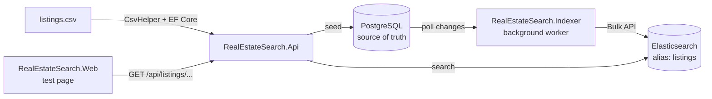

# RealEstateSearch

A map-based listing search built with C# and ASP.NET Core, using **PostgreSQL as the source of truth** and **Elasticsearch as a search-optimized copy**, kept in sync by a background worker.

Users pick a location (a neighbourhood or the visible map area) and narrow results with a few filters: price, room type, guests, and length of stay.

## demo 
https://github.com/user-attachments/assets/e7fb7d0c-60f0-4631-899d-72203b6ec50f

## Architecture



| Component | Role |
|---|---|
| **PostgreSQL** | Stores every listing, including ones that should not be searchable |
| **Elasticsearch** | Holds only listings users can book, structured for filters and geo queries |
| **Indexer** | Keeps Elasticsearch within ~10 seconds of PostgreSQL. A separate process, so the API can scale out while exactly one sync worker runs |
| **Api** | Search endpoints. Reads from Elasticsearch only |
| **Web** | A plain HTML/JavaScript page to try the API |

The write path (PostgreSQL → Elasticsearch) and the read path (Elasticsearch → API) are independent: searches never touch PostgreSQL.

## Tech Stack

| Area | Choice |
|---|---|
| Runtime | .NET 10: ASP.NET Core (Web API, controllers), Worker Service |
| Database | PostgreSQL 16, EF Core 10 + Npgsql provider |
| Search | Elasticsearch 9.5.3, `Elastic.Clients.Elasticsearch` 9.5.3 |
| Front end | Static HTML + JavaScript, Leaflet for the map |
| Tooling | Docker Compose, Kibana 9.5.3 (Dev Tools) |
| CSV parsing | CsvHelper |

## Project Structure

```
.
├── docker-compose.yml                    # PostgreSQL, Elasticsearch, Kibana
├── RealEstateSearch.slnx
└── src/
    ├── RealEstateSearch.Data/            # Class library shared by Api and Indexer
    │   ├── AppDbContext.cs               #   sets CreatedAt/UpdatedAt on save
    │   ├── Models/Listing.cs             #   database row
    │   ├── Search/ListingDocument.cs     #   index document + "is searchable" rule + alias name
    │   └── Migrations/
    ├── RealEstateSearch.Api/             # ASP.NET Core Web API
    │   ├── Controllers/ListingsController.cs
    │   ├── Services/ListingSearchService.cs   # request → Elasticsearch query → response
    │   ├── Models/                       #   request (with validation) and response DTOs
    │   ├── SeedData/                     #   CSV importer + listings.csv
    │   └── RealEstateSearch.Api.http     #   ready-to-run sample requests
    ├── RealEstateSearch.Indexer/         # Worker Service: PostgreSQL → Elasticsearch
    │   ├── Worker.cs                     #   orchestrates the steps
    │   ├── Elasticsearch/
    │   │   ├── listings-index.json       #   index settings + mappings
    │   │   └── ListingIndexManager.cs    #   creates index and alias
    │   └── Sync/
    │       ├── ListingSyncer.cs          #   backfill + incremental sync via Bulk
    │       └── SyncOptions.cs            #   poll interval and overlap window
    └── RealEstateSearch.Web/             # Test page
        └── wwwroot/                      #   index.html + app.js
```

**Why three back-end projects:** the Api and the Indexer are two separate programs (a web server that may run on several machines, and a worker that must run exactly once). Both need the same entity, `DbContext`, and index document shape, so those live in the `Data` class library that both reference.

## Getting Started

**Prerequisites:** .NET 10 SDK, Docker Desktop, and the EF Core CLI (`dotnet tool install --global dotnet-ef`).

### First run

```bash
# 1. Start PostgreSQL, Elasticsearch, and Kibana
docker compose up -d

# 2. Create the database schema
dotnet ef database update \
  --project src/RealEstateSearch.Data \
  --startup-project src/RealEstateSearch.Api

# 3. Start the API. On first start it imports the CSV into PostgreSQL
dotnet run --project src/RealEstateSearch.Api

# 4. In a second terminal: create the index and copy listings into it.
#    Logs "Backfill finished: 2660 indexed, ..." then keeps watching for changes
dotnet run --project src/RealEstateSearch.Indexer

# 5. In a third terminal: start the test page (opens http://localhost:5300)
dotnet run --project src/RealEstateSearch.Web
```

### Later runs

Data persists in Docker volumes, so only the programs need to start: `docker compose up -d`, then the Api and the Web page. Run the Indexer only when PostgreSQL data changes. Stop each program with `Ctrl+C`.

| Service | URL |
|---|---|
| Test page | http://localhost:5300 |
| Search API | http://localhost:5241/api/listings/search |
| Elasticsearch | http://localhost:9200 |
| Kibana Dev Tools | http://localhost:5601/app/dev_tools#/console |
| PostgreSQL | `localhost:5432` (db `realestate`, user/password `postgres`) |

All Docker ports are bound to `127.0.0.1` only, because Elasticsearch security is disabled for local development.

## Search API

### `GET /api/listings/search`

All parameters are optional.

| Parameter | Example | Elasticsearch filter |
|---|---|---|
| `neighbourhood` | `La Jolla` | `term` on `neighbourhood` |
| `minLat`, `maxLat`, `minLon`, `maxLon` | visible map area | `geo_bounding_box` on `location` (all four or none) |
| `minPrice`, `maxPrice` | `100`, `300` | `range` on `pricePerNight` |
| `roomType` | `Entire home/apt` | `term` on `roomType` |
| `guests` | `4` | `accommodates >= guests` |
| `stay` | `short` / `long` | `minimumNights < 30` / `>= 30` |
| `sort` | `priceAsc` (default) / `priceDesc` | sort on `pricePerNight` |
| `page`, `pageSize` | `1`, `20` (defaults; max 100 each) | `from`, `size` |

```http
GET /api/listings/search?neighbourhood=La%20Jolla
```

```json
{
  "total": 194,
  "page": 1,
  "pageSize": 20,
  "items": [
    {
      "id": "1247205685427161794",
      "name": "Entire studio & House",
      "neighbourhood": "La Jolla",
      "roomType": "Entire home/apt",
      "pricePerNight": 64.51,
      "accommodates": 3,
      "latitude": 32.81671,
      "longitude": -117.24077
    }
  ]
}
```

(Response shortened.)

### `GET /api/listings/neighbourhoods`

Neighbourhood names with listing counts, for the location picker. Uses a `terms` aggregation on the `neighbourhood` keyword field, so no documents are returned. Only neighbourhoods with at least one searchable listing appear (93 of 96).

```json
[ { "name": "Mission Bay", "count": 361 }, { "name": "Pacific Beach", "count": 250 } ]
```

### How a request is handled

```
ListingsController     [ApiController] binds the query string to ListingSearchRequest and validates it
        │              invalid → 400 before the action runs
        ▼
ListingSearchService   values that were sent → bool.filter clauses; page → from/size
        │              hits → ListingSummary (the API's own response shape)
        ▼
Elasticsearch          alias "listings"
```

| Design choice | Why |
|---|---|
| Thin controller, logic in a service | The controller only deals with HTTP; the query building can change without touching routing or validation |
| Validation with `[Range]` and `IValidatableObject` | Single-field rules (latitude range, page size) and cross-field rules (all four map bounds or none, `minPrice ≤ maxPrice`) return `400` with per-field messages, without any `if` in the controller |
| Nullable filter properties | "Not sent" (`null`, no filter) is different from `0` |
| Separate response DTO (`ListingSummary`) | The index document can change without breaking API clients; it also adds `id` and flattens the location |
| `track_total_hits = true` | Exact totals instead of Elasticsearch's default "10,000+" |
| `page` and `pageSize` capped at 100 | Keeps `from + size` under Elasticsearch's 10,000 result window |
| `AddProblemDetails` + `UseExceptionHandler` | If Elasticsearch is down, clients get a standard JSON `500` without a stack trace; the cause is logged on the server |
| CORS limited to `Cors:AllowedOrigins` | The test page runs on another port, which the browser treats as another origin; only listed origins may call the API |

Sample requests, including validation errors, are in [`RealEstateSearch.Api.http`](src/RealEstateSearch.Api/RealEstateSearch.Api.http) (run them from VS Code with the REST Client extension).

**Verified** by running the API against the indexed data: totals match counts taken directly in Kibana and PostgreSQL (2,660 overall, 194 in La Jolla, 39 for the Mission Bay map area with all filters, 799 long stays); every result of the filtered query was checked against each filter; pages do not overlap; invalid inputs return `400`; stopping Elasticsearch returns `500` and the API recovers when it is back.

## Test Page

`RealEstateSearch.Web` is an ASP.NET Core app that only serves two static files. Everything else happens in the browser, which calls the Api directly.

- Location: neighbourhood dropdown (filled from `/neighbourhoods`) or "Map area", which sends the bounds of the visible Leaflet map
- Filters, sort, previous/next page
- Results as a table and as map markers
- `400` validation messages from the API are shown on the page

Listing names are inserted with `textContent`, not `innerHTML`, because they come from external data.

## Data Import

Source: [Inside Airbnb](https://insideairbnb.com/) San Diego listings (CC BY 4.0). The file has 24,837 lines but 13,225 records, because descriptions contain quoted line breaks; CsvHelper handles this correctly where a naive `Split(',')` would not. The importer currently loads the first 3,000 records.

| Rule | Reason |
|---|---|
| Rows without an ID or coordinates are skipped and counted | Defaulting to `0` would create fake data, e.g. a listing at `(0, 0)` |
| Missing optional fields are stored as `null` | A missing value is different from `0` |
| Prices are `decimal` (`numeric` in PostgreSQL) | Money must not have floating point error |
| Dates are parsed with a fixed format and stored as UTC | PostgreSQL `timestamptz` only accepts UTC through Npgsql |
| The Airbnb ID is the primary key (`ValueGeneratedNever`) | The same ID is reused as the Elasticsearch `_id` |
| IDs are parsed strictly (`NumberStyles.None`) | Excel shows 19-digit IDs as `1.53E+18`; a re-saved file loses digits, and that should fail loudly |
| `CreatedAt` / `UpdatedAt` are set in `AppDbContext.SaveChangesAsync` | Every save path keeps `UpdatedAt` accurate for change detection |
| `IsDeleted` is a soft delete flag | The sync worker can only see deletions that leave a row behind |

## Index Design

The index was designed from the queries the UI needs, not from the table shape.

### What is searchable

| UI | Field | Coverage* |
|---|---|---|
| Location: neighbourhood picker | `neighbourhood` | 100% |
| Location: map area | `location` | 100% |
| Filter: price range | `pricePerNight` | 100% |
| Filter: room type | `roomType` (4 values) | 100% |
| Filter: guests | `accommodates` | 100% |
| Filter: short / long stay | `minimumNights` | 99.9% |

\* Among listings that are indexed. Filters were limited to fields that are (almost) always present, because a filter on a sparse field silently hides listings. For example, `bedrooms` is missing in 16% of rows, so `accommodates` is used instead.

There is no free-text search. Every condition is a yes/no filter, so queries use `bool.filter`: no relevance scoring, cacheable, and predictable.

### What gets indexed

A listing is in Elasticsearch only when **`IsDeleted = false` and `PricePerNight` is not null**. Otherwise the worker deletes it from the index.

Missing prices are not random: 142 of the 145 listings with zero availability have no price, so a missing price means "not bookable right now". These rows stay in PostgreSQL and come back to search as soon as they get a price.

### Mapping

Defined in [`listings-index.json`](src/RealEstateSearch.Indexer/Elasticsearch/listings-index.json).

| Field | Type | Notes |
|---|---|---|
| `location` | `geo_point` | Latitude + longitude combined, enables bounding box and distance queries |
| `neighbourhood`, `roomType` | `keyword` | Exact filters and aggregations |
| `pricePerNight` | `scaled_float` (×100) | Exact to the cent, no `decimal` type in Elasticsearch |
| `accommodates`, `minimumNights` | `integer` | Range filters |
| `updatedAt` | `date` | Shows which version of the row is indexed |
| `name`, `description`, `propertyType`, `bedrooms`, `beds`, `bathrooms`, `reviewScoreRating` | various, `index: false` | Display only: returned in results, no index structures built |

`CreatedAt`, `LastScraped`, and `IsDeleted` are not sent. The document `_id` is the Airbnb ID, so re-sending a listing overwrites it instead of duplicating it.

### Index settings

| Setting | Value | Reason |
|---|---|---|
| Shards | 1 | A few MB of data; more shards would only add overhead |
| Replicas | 0 | Single node; a replica would have nowhere to go and turn the index yellow |
| `dynamic` | `strict` | Unknown fields are rejected instead of silently added |
| Name | `listings_v1` behind alias `listings` | Readers and writers only use the alias, so a mapping change can later become: build `listings_v2`, fill it, swap the alias atomically, with no search downtime |

The alias is not part of the JSON file. If it were, creating `listings_v2` from the same file would attach the alias to both indices and every listing would appear twice.

## Indexer

`Worker` only decides the order of steps; each step lives in its own class.

### 1. Ensure the index (`ListingIndexManager`)

1. Pings Elasticsearch, retrying with exponential backoff (1s → 16s, up to 2 minutes), because Elasticsearch takes 20–40 seconds to boot and the worker may start first.
2. Stops if the `listings` alias already exists.
3. Otherwise creates `listings_v1` from the embedded JSON file (or reuses it if a previous run stopped halfway).
4. Attaches the `listings` alias.

Running it again does nothing, so it is safe on every startup.

### 2. Backfill (`ListingSyncer`)

Copies the whole table on every startup, so the index matches PostgreSQL even after downtime.

| Step | How | Why |
|---|---|---|
| Read | 500 rows at a time with `WHERE Id > @lastId ORDER BY Id` | Keyset pagination uses the primary key B-tree; unlike `OFFSET`, later pages are not slower |
| Decide | Searchable → `index`, otherwise → `delete` | Listings that were sold or lost their price are removed, not left behind |
| Send | One Bulk request per batch, with `require_alias=true` | If the alias were missing, ES would otherwise auto-create a `listings` index with guessed field types |
| Check | Inspect every item in the response | Bulk returns HTTP 200 even when some items fail |

A failed document is logged with its ID and reason and the rest continue; a failed request stops the worker. The run ends with a summary such as `2660 indexed, 0 deleted, 340 not searchable and already absent, 0 failed`. Re-running gives the same result because each document is keyed by `_id`.

### 3. Incremental sync (`ListingSyncer`)

After the backfill, the worker polls for changed rows every 10 seconds and sends them through the same index/delete logic.

```
checkpoint = MAX(UpdatedAt)          -- taken before the backfill, so changes made during it are not missed
every 10s:
    read rows WHERE (UpdatedAt, Id) > (checkpoint - 30s, ...) ORDER BY UpdatedAt, Id, 500 at a time
    send them with Bulk
    checkpoint = newest UpdatedAt seen (never moves back)
```

| Decision | Why |
|---|---|
| Checkpoint comes from the data (`MAX(UpdatedAt)`), not the worker's clock | `UpdatedAt` is stamped by whoever writes the row; comparing it with another machine's clock would miss changes when the clocks drift |
| Re-read a 30s overlap window | A slow transaction can commit *after* a faster one with a later `UpdatedAt` already moved the checkpoint past it. Re-sent rows are harmless: same `_id`, same content |
| Page by `(UpdatedAt, Id)`, backed by index `IX_Listings_UpdatedAt_Id` | `UpdatedAt` is not unique (one save stamps many rows), so `Id` breaks ties; the B-tree index avoids a full table scan on every poll |
| `PeriodicTimer` instead of `Task.Delay` | Fixed cadence, and ticks never overlap, so there is still only one writer, in order |
| On failure, log and keep the checkpoint | A short PostgreSQL or Elasticsearch outage should not kill the worker; the next tick re-reads the same range |

`PollInterval` and `Overlap` are configurable in the `Sync` section of `appsettings.json`.

Verified by changing rows in PostgreSQL while the worker runs: price updates, soft deletes and restores, a price set to `null` and back, a slow transaction overtaken by a faster one, and a 25 second Elasticsearch outage. Each change reached the index within about 10 seconds.

**Known limits**

- `UpdatedAt` is set in `AppDbContext.SaveChangesAsync`, so writes that bypass EF Core (raw SQL) are not detected unless they set it too. A database trigger would close this gap.
- A hard-deleted row leaves its document in the index, since there is no row left to read. The app only soft deletes; a periodic reconciliation of IDs would catch mistakes.
- A transaction that commits more than 30 seconds late is missed.
- The checkpoint lives in memory, so every restart runs a full backfill.

### Lifetimes

| Service | Lifetime | Reason |
|---|---|---|
| `ElasticsearchClient` | Singleton | Thread-safe and owns the HTTP connection pool (same in the Api) |
| `ListingIndexManager`, `ListingSyncer` | Singleton | Stateless; `Worker` holds the checkpoint and passes it in |
| `AppDbContext` | Scoped | Tracks changes and is not thread-safe; the syncer opens a short-lived scope per batch (`IServiceScopeFactory`) instead of holding one for the app's lifetime |

## Roadmap

- [x] Import CSV into PostgreSQL with EF Core
- [x] Run PostgreSQL, Elasticsearch, and Kibana with Docker Compose
- [x] Design the index mapping from the search UI requirements
- [x] Split shared data access into `RealEstateSearch.Data`
- [x] Create the index and alias from the worker on startup
- [x] Backfill: send all searchable listings with the Bulk API and check per-item errors
- [x] Incremental sync: poll `UpdatedAt` with an overlap window (late commits) and send `index` or `delete`
- [x] Search API: location + filters, sorting, paging, validation
- [x] Test page with a map

### What I would add next, and why

This is an MVP. These were left out on purpose and are listed with the reason they would matter.

| Addition | Why |
|---|---|
| Reindex to `listings_v2` and swap the alias | The alias is already in place; this makes mapping changes possible without search downtime |
| Move CSV seeding out of Api startup | With several API instances starting at once, each could try to import |
| Swagger UI | Browsable, clickable API docs; the OpenAPI package is already referenced |
| Return `503` when Elasticsearch is unavailable | More accurate than `500`, and lets clients retry |
| Repository interface between service and Elasticsearch | Makes the search service unit-testable and the store swappable |
| Automated tests | Everything above was verified by hand |
| Elasticsearch security, API keys, secrets in User Secrets or environment variables | Required outside local development |
| Persist the sync checkpoint | Avoids a full backfill on every Indexer restart |
| Set `UpdatedAt` with a database trigger; reconcile index IDs | Covers raw SQL writes and accidental hard deletes |
| Import all 13,225 rows and `amenities` | More data, and filters such as "pool" |
